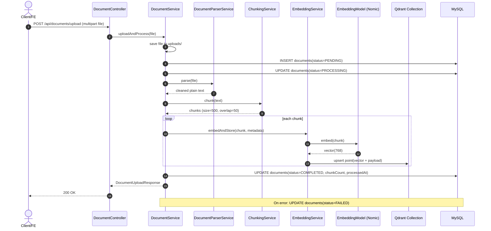
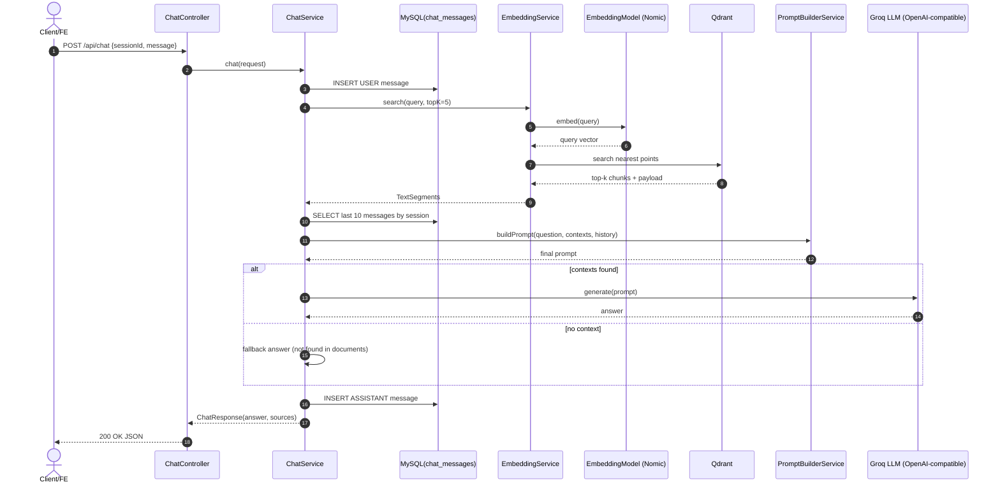

# Backend Documentation - RAG Chatbot (Spring Boot + LangChain4j)

## 1. Backend Architecture Overview

Backend được xây dựng theo mô hình RAG (Retrieval-Augmented Generation) với 2 lớp lưu trữ:

- **MySQL**: lưu metadata tài liệu và chat history theo session.
- **Qdrant**: lưu vector embedding + payload metadata cho truy hồi ngữ nghĩa.

Luồng chính:

1. User gửi câu hỏi qua API chat.
2. Service tạo embedding cho query.
3. `ContentRetriever` (triển khai thực tế trong `EmbeddingService.search`) truy vấn Qdrant lấy top-k chunks liên quan.
4. Prompt được ghép từ: system instruction + context chunks + chat history.
5. LangChain4j gọi LLM (Groq qua OpenAI-compatible API).
6. Trả về answer + sources cho client (sync JSON hoặc streaming SSE).

## 2. Core Logic: LangChain4j + Qdrant + LLM

### 2.1 LLM Configuration (Groq qua OpenAI-compatible API)

Backend dùng `OpenAiChatModel` của LangChain4j nhưng trỏ `baseUrl` sang Groq:

- Bean: `OpenAiChatModel` trong `GroqConfig`.
- Cấu hình: `groq.api-key`, `groq.base-url`, `groq.chat-model`.
- Tham số runtime chính: `temperature=0.7`, `maxTokens=1000`.

Điều này cho phép tận dụng API contract OpenAI trong khi model thực thi ở Groq.

### 2.2 Embedding Configuration

Embedding model được cấu hình qua bean `EmbeddingModel` (`NomicEmbeddingModel`):

- Cấu hình: `nomic.api-key`, `nomic.embedding-model`.
- Kích thước vector kỳ vọng: `qdrant.vector-size=768` (phải đồng bộ với model embedding).

### 2.3 Qdrant Configuration

`QdrantConfig` khởi tạo:

- Bean `QdrantEmbeddingStore` với `host`, `port`, `collection-name`.
- `ApplicationRunner` kiểm tra/tạo collection khi app start qua Qdrant HTTP API:
	- Endpoint: `PUT /collections/{collectionName}`
	- Vector params: `size=<vector-size>`, `distance=Cosine`.

### 2.4 AiServices/Orchestration Layer

Thiết kế RAG chuẩn của LangChain4j là dùng `AiServices` + `ContentRetriever`.

Trong code hiện tại, orchestration được triển khai trực tiếp trong `ChatService` (manual prompting), đóng vai trò tương đương:

- Truy hồi context: `EmbeddingService.search(query, topK)`.
- Prompt assembly: `PromptBuilderService.buildPrompt(...)`.
- LLM invoke: `chatModel.generate(prompt)` hoặc `OpenAiStreamingChatModel.generate(...)`.

Khi cần mở rộng, có thể refactor sang `AiServices` chính thức để tách rõ conversational policy, tools và retrieval policy.

## 3. Data Pipeline (Upload -> Chunk -> Vectorize)

Pipeline ingestion trong `DocumentService.uploadAndProcess`:

1. **Persist raw file**
	 - Lưu file vào thư mục `app.upload-dir` (mặc định `./uploads`).
	 - Đổi tên theo timestamp để tránh trùng.

2. **Create metadata row (MySQL)**
	 - Ghi vào bảng `documents` với trạng thái `PENDING`.

3. **Parse document**
	 - Hỗ trợ định dạng: `.pdf`, `.txt`.
	 - PDF parse bằng Apache PDFBox, có bước clean text để chuẩn hóa ký tự whitespace/line-break.

4. **Chunking strategy**
	 - `CHUNK_SIZE = 500` ký tự.
	 - `CHUNK_OVERLAP = 50` ký tự.
	 - Heuristic split boundary:
		 - ưu tiên ngắt ở `". "` hoặc newline gần cuối chunk,
		 - chỉ nhận breakpoint nằm ở nửa sau chunk để giữ chunk đủ ngữ nghĩa.
	 - Mục tiêu: giảm mất ngữ cảnh cục bộ và tăng recall khi semantic search.

5. **Embedding + Store to Qdrant**
	 - Mỗi chunk được embed bằng embedding model.
	 - Mỗi point lưu vào Qdrant gồm vector + payload:
		 - `documentId`, `fileName`, `chunkIndex`, `text_segment`.

6. **Finalize status**
	 - Thành công: `COMPLETED`, cập nhật `chunkCount`, `processedAt`.
	 - Lỗi: `FAILED`.

## 4. Database Schema

### 4.1 MySQL - Chat History & Document Metadata

#### `chat_messages`

```sql
CREATE TABLE chat_messages (
	id BIGINT PRIMARY KEY AUTO_INCREMENT,
	session_id VARCHAR(255) NOT NULL,
	role VARCHAR(20) NOT NULL,           -- USER | ASSISTANT
	content TEXT NOT NULL,
	sources TEXT NULL,                   -- JSON string nguồn tham chiếu
	created_at DATETIME NOT NULL
);

CREATE INDEX idx_chat_messages_session_created
	ON chat_messages(session_id, created_at);
```

#### `documents`

```sql
CREATE TABLE documents (
	id BIGINT PRIMARY KEY AUTO_INCREMENT,
	file_name VARCHAR(255) NOT NULL,
	file_path VARCHAR(500) NOT NULL,
	file_type VARCHAR(20) NOT NULL,      -- PDF | TXT | UNKNOWN
	file_size BIGINT NULL,
	status VARCHAR(20) NOT NULL,         -- PENDING | PROCESSING | COMPLETED | FAILED
	chunk_count INT NULL,
	created_at DATETIME NOT NULL,
	processed_at DATETIME NULL
);
```

#### `user_sessions` (recommended)

Code hiện tại lưu session dưới dạng `sessionId` trong `chat_messages`. Để quản trị tốt hơn (TTL, owner, device, analytics), nên bổ sung bảng:

```sql
CREATE TABLE user_sessions (
	session_id VARCHAR(255) PRIMARY KEY,
	user_id VARCHAR(255) NULL,
	started_at DATETIME NOT NULL,
	last_activity_at DATETIME NOT NULL,
	status VARCHAR(20) NOT NULL          -- ACTIVE | CLOSED | EXPIRED
);
```

### 4.2 Qdrant - Collection Structure

Collection mặc định: `documents`

- `vectors.size = 768`
- `vectors.distance = Cosine`

Point payload chuẩn:

```json
{
	"documentId": "123",
	"fileName": "onboarding-policy.pdf",
	"chunkIndex": "7",
	"text_segment": "...raw chunk text..."
}
```

Khuyến nghị index/filter fields cho scale lớn:

- `documentId` (keyword)
- `fileName` (keyword)

## 5. RAG Flow Runtime

1. API nhận `sessionId` + `message`.
2. Lưu user message vào `chat_messages`.
3. Embed query.
4. Search Qdrant lấy `topK=5` chunks gần nhất.
5. Build prompt gồm:
	 - system prompt policy,
	 - `[TÀI LIỆU THAM KHẢO]` (retrieved chunks),
	 - `[LỊCH SỬ HỘI THOẠI]` (10 message gần nhất theo session),
	 - `[CÂU HỎI HIỆN TẠI]`.
6. Generate response từ LLM.
7. Lưu assistant message vào `chat_messages`.
8. Trả response dạng JSON hoặc stream token qua SSE.

## 6. API Endpoints (REST)

Base path: `/api`

### 6.1 Upload Document

- **Method**: `POST`
- **URL**: `/api/documents/upload`
- **Content-Type**: `multipart/form-data`
- **Form field**: `file`

Response thành công:

```json
{
	"id": 101,
	"fileName": "handbook.pdf",
	"status": "COMPLETED",
	"message": "Upload và xử lý thành công! Đã tạo 42 chunks."
}
```

Response lỗi business (file không hợp lệ):

```json
{
	"status": "FAILED",
	"message": "Chỉ hỗ trợ file PDF và TXT..."
}
```

### 6.2 List Documents

- **Method**: `GET`
- **URL**: `/api/documents`
- **Response**: danh sách bản ghi `documents`.

### 6.3 Chat (Synchronous)

- **Method**: `POST`
- **URL**: `/api/chat`
- **Content-Type**: `application/json`

Request:

```json
{
	"sessionId": "2b2f8e4a-7f8b-4f4a-88be-9c5fd5f8ab10",
	"message": "Quy trình xin nghỉ phép như thế nào?"
}
```

Response:

```json
{
	"answer": "...",
	"sources": [
		{
			"fileName": "company-policy.pdf",
			"chunkText": "..."
		}
	]
}
```

### 6.4 Chat (Streaming SSE)

- **Method**: `POST`
- **URL**: `/api/chat/stream`
- **Produces**: `text/event-stream`

SSE events:

- `event: token` với payload JSON `{"token":"..."}`
- `event: done` với payload là JSON array sources

## 7. Error Handling & Security

### 7.1 Error Handling

Hiện trạng triển khai:

- Validate input cơ bản ở `ChatController`:
	- thiếu `message` hoặc `sessionId` -> HTTP `400`.
- Upload pipeline bọc `try/catch`:
	- `IllegalArgumentException` -> HTTP `400` + message nghiệp vụ.
	- Exception khác -> HTTP `500`.
- Khi không retrieve được context (`segments.isEmpty()`):
	- Trả fallback answer: *không tìm thấy thông tin liên quan*.
- SSE stream:
	- Lỗi trong token streaming hoặc LLM callback -> `emitter.completeWithError(...)`.

Khuyến nghị production:

- Dùng `@RestControllerAdvice` để chuẩn hóa error contract (`code`, `message`, `traceId`).
- Thêm retry/backoff cho lỗi tạm thời từ LLM/Qdrant.
- Thêm timeout + circuit breaker (Resilience4j) cho LLM call.

### 7.2 Security

Hiện trạng:

- CSRF disable (phù hợp REST stateless).
- CORS whitelist cho FE local (`5173`, `3000`).
- `permitAll()` cho toàn bộ API (phù hợp giai đoạn dev).

Khuyến nghị hardening:

- Bổ sung JWT/OAuth2 Resource Server cho `/api/**`.
- Chặn upload theo MIME sniffing + antivirus scan nếu cần.
- Rate limiting cho endpoint chat để tránh abuse.
- Không commit secrets vào source (`application*.yml`), chuyển sang env vars/secret manager.

## 8. Operational Notes

- Đồng bộ chặt chẽ giữa `embedding model` và `qdrant.vector-size`.
- Nếu đổi embedding model, cần re-embed toàn bộ dữ liệu để tránh mismatch semantic space.
- Với dataset lớn, cân nhắc:
	- batch embedding,
	- async ingestion queue,
	- payload filter theo `documentId`/tenant để tăng precision.

## 9. Sequence Diagrams

### 9.1 Document Ingestion Flow (Upload -> Chunk -> Embed -> Store)



### 9.2 RAG Chat Flow (Retrieve -> Prompt -> Generate)



