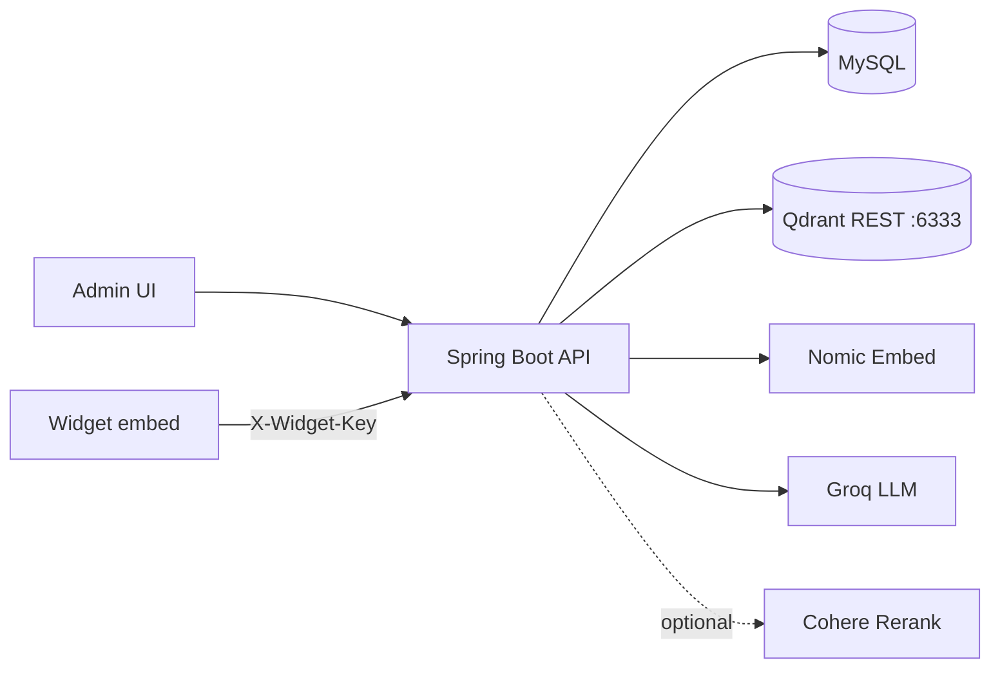

# Kiến trúc hệ thống — Canonical truth

Concise architecture reference. Chi tiết đầy đủ: [`docs/architecture/FINAL_BACKEND_RAG_ARCHITECTURE_20260529.md`](../docs/architecture/FINAL_BACKEND_RAG_ARCHITECTURE_20260529.md) và [`docs/architecture/FINAL_RAG_PIPELINE_OVERVIEW_20260529.md`](../docs/architecture/FINAL_RAG_PIPELINE_OVERVIEW_20260529.md).

Thesis prose: [`docs/architecture/THESIS_ARCHITECTURE_SUMMARY_20260529.md`](../docs/architecture/THESIS_ARCHITECTURE_SUMMARY_20260529.md)

---

## Mô hình tổng thể

- Client–server: Frontend (React) + Backend (Spring Boot).
- Multi-tenant theo **WidgetConfig** (`widgetId`): documents, chunks, sessions, Qdrant filter đều scoped.
- Polyglot persistence: **MySQL** (transactional) + **Qdrant REST :6333** (vectors).



---

## Package map

| Package | Class chính | Vai trò |
|---------|-------------|---------|
| `api` | Controllers | HTTP endpoints |
| `service` | `DocumentService`, `WidgetService` | Upload lifecycle, admin, cascade delete orchestration |
| `ingest.parser` | `DocumentParserService`, `RawTableModel` | PDF/DOCX/TXT → sections + raw tables |
| `ingest.normalize` | `NormalizedTableService` | Raw table → `normalized_table_row`, `cells_json` |
| `ingest.chunking` | `ChunkingService2` | Section → `DocumentChunk` list |
| `index.embedding` | `EmbeddingService` | Nomic embed + **Qdrant REST** upsert/search |
| `index.qdrant` | `QdrantConfig`, `QdrantPurgeService` | Collection bootstrap + purge by `document_id` |
| `rag.retrieve` | `RagRetrievalService`, `KeywordSearchService` | 7-step hybrid retrieval |
| `rag.prompt` | `PromptBuilderService` | System prompt + context + history |
| `rag.analysis` | `QueryAnalyzerService`, `QuerySignalExtractor` | Query type, keyword signals |
| `rag.rerank` | `RerankService` | Optional Cohere cross-encoder |
| `rag.budget` | `PromptBudgetResolver` | Context char budget by query type |
| `rag.runtime` | `ChatService`, `PlaygroundService` | Chat sync/SSE, playground |
| `audit.metrics` | `RagTokenAudit`, `RagLatencyTrace` | Structured audit logs |
| `llm` | `LlmFallbackService` | Groq sync/stream + model fallback |
| `domain` | Entities + repositories | JPA persistence |

**Removed / stale paths (do NOT use):**

- `service.ChatService`, `service.RagRetrievalService`, `service.EmbeddingService`, `service.DocumentParserService`, `service.LlmFallbackService` — moved 25B–25D
- LangChain4j `QdrantEmbeddingStore` / gRPC write — removed 24D4
- DOCX Markdown bridge as primary table path — not current

---

## Ingest pipeline

```text
POST /api/documents/upload/{widgetId}
  → DocumentService
  → DocumentParserService (ingest.parser)
       PDF: PDFBox + Tabula → RawTableModel (coordinate overlap)
       DOCX: Apache POI logical grid → RawTableModel (physicalColIndex)
       TXT: plain read
  → NormalizedTableService (ingest.normalize)
       → normalized_table_row + cells_json (UTF-8)
  → ChunkingService2 (ingest.chunking)
       → text, section_summary, parent_section_summary, table_summary, normalized_table_row
       ✗ NOT table_row_group, text_table_like (legacy read-only)
  → EmbeddingService.upsert (index.embedding) — Qdrant REST
  → MySQL: DocumentSection, DocumentChunk
  → Document.status = COMPLETED
```

Chunk params: max 2200 chars, overlap 250.

---

## Retrieval pipeline (7 bước)

```text
0. Intent detection (QueryAnalyzerService → QueryType)
1. Fetch all sections (shared)
2. Heading-first match → optional scope lock (ANCHOR_TOP_K=30)
3. Query rewrite (≤4 variants) + vector search Qdrant (filter widgetId)
4. Context pool: locked / semantic / expanded modes
5. Optional Cohere rerank (COHERE_RERANK_ENABLED)
6. Dedup → sort → budget (FINAL_LIMIT 10/20/60 by mode)
7. Log final context
```

Hybrid keyword: `KeywordSearchService` + cell-aware boost for `normalized_table_row`.

**Not implemented:** adaptive context-N / dynamic topK.

---

## Delete cascade

```text
DELETE /api/chatbots/{id}
  → WidgetService.softDeleteChatbot(id)
  → for each active document: DocumentService.softDeleteDocument(docId)
       → QdrantPurgeService purge by document_id
       → soft-delete document_tables, sections, chunks, document
  → soft-delete WidgetConfig

DELETE /api/documents/{id}
  → DocumentService.softDeleteDocument(id)
       → Qdrant purge by document_id
       → soft-delete related DB rows
```

Never drop Qdrant collection for routine cleanup.

---

## Storage architecture

### MySQL (`ragchatbot`)

UUID PK, soft delete via `deleted_at`. Key tables: `widget_configs`, `documents`, `document_sections`, `document_chunks`, `document_tables`, `chat_sessions`, `chat_messages`.

### Qdrant

| Property | Value |
|----------|-------|
| Collection | `documents` |
| Vector size | 768 |
| Distance | Cosine |
| Write/search | REST HTTP **6333** via `EmbeddingService` |
| gRPC 6334 | Exposed in Docker for tooling only — **not** application write path |

Payload highlights: `widgetId`, `documentId`, `chunk_type`, `cells_json`, `heading_path`, `section_id`, `order_index`.

### Chunk types (current ingest)

| Type | Status |
|------|--------|
| `normalized_table_row` | Primary — table row with `cells_json` |
| `table_summary` | Table description |
| `text` | Plain text chunk |
| `section_summary` | Long section summary |
| `parent_section_summary` | Parent section + child list |
| `table_row_group` | **Legacy** — read-compatible only |
| `text_table_like` | **Legacy** — read-compatible only |

---

## Frontend modules (summary)

- `ChatPage`, `DocumentPage`, `WidgetChatPage`
- `widget/widget.js` — IIFE embed
- Chi tiết: [`agent/04-frontend.md`](04-frontend.md)

---

## References

| Doc | Content |
|-----|---------|
| `FINAL_BACKEND_RAG_ARCHITECTURE_20260529.md` | Full backend architecture |
| `FINAL_RAG_PIPELINE_OVERVIEW_20260529.md` | Pipeline diagrams |
| `THESIS_ARCHITECTURE_SUMMARY_20260529.md` | Thesis chapter prose |
| `THESIS_RAG_PIPELINE_DESCRIPTION_20260529.md` | Diagram-first pipeline |
| `.cursor/rules/10-backend-rag-rule.mdc` | AI editing constraints |
| `.cursor/rules/40-db-vector-rule.mdc` | DB/Qdrant constraints |
