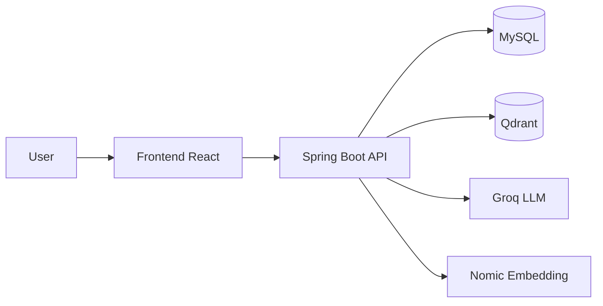

# Kiến trúc hệ thống

## Mô hình tổng thể
- Kiến trúc tách lớp FE/BE.
- Backend thực thi pipeline RAG trên dữ liệu nội bộ.
- Dữ liệu persistence tách đôi:
  - MySQL cho dữ liệu giao dịch (documents, chat_messages).
  - Qdrant cho vector search.

## Sơ đồ luồng nghiệp vụ

## Các module backend chính
- `DocumentService`: orchestration luồng upload -> xử lý -> cập nhật trạng thái.
- `DocumentParserService`: parse nội dung PDF/TXT.
- `ChunkingService`: chia đoạn văn bản cho retrieval.
- `EmbeddingService`: tạo embedding + upsert/search Qdrant.
- `ChatService`: điều phối chat sync/stream và lưu hội thoại.
- `PromptBuilderService`: dựng prompt từ context + history + câu hỏi hiện tại.

## Các module frontend chính
- `ChatPage`: giao diện chat chính.
- `DocumentPage`: quản lý danh sách tài liệu.
- `WidgetChatPage`: giao diện chat tối giản trong iframe widget.
- `widget/widget.js`: bootstrap widget (bubble + iframe) để nhúng website ngoài.
