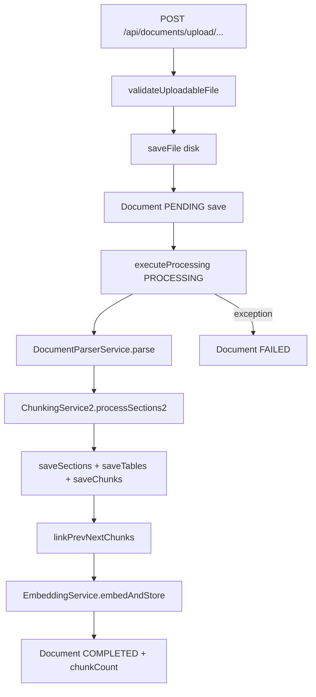
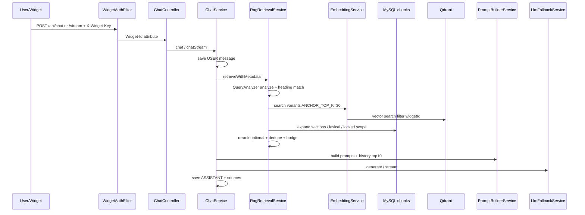
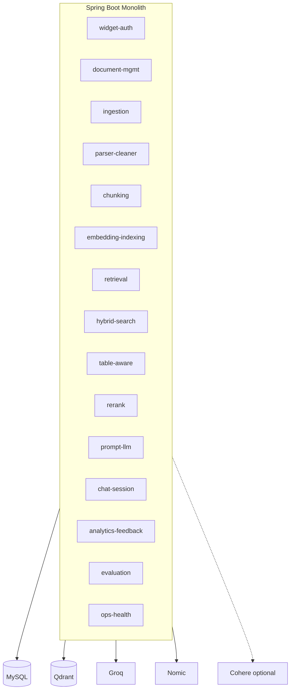

# RAG Target Architecture — CHATBOT_RAG

**Loại tài liệu:** Kiến trúc đích + roadmap triển khai, dựa trên **source thực tế** trong repo tại thời điểm audit (Spring Boot backend, React/Vite frontend, MySQL, Qdrant, Groq LLM, Nomic embedding, Cohere rerank optional).

**Chú thích nguồn:**

| Ký hiệu | Ý nghĩa |
|--------|---------|
| **SOURCE** | Xác nhận từ class/file/config trong repo (đường dẫn ghi rõ). |
| **PROPOSE** | Đề xuất kiến trúc / phase tương lai — **chưa** có implementation đầy đủ trong code hiện tại. |

---

## 1. Executive summary

Hệ thống hiện tại là **modular monolith thực tế** (một JVM Spring Boot) với pipeline RAG end-to-end: upload PDF/TXT → parse (PDFBox + Tabula) → chunk (`ChunkingService2`) → embed (Nomic) → upsert Qdrant → chat với truy hồi đa bước (`RagRetrievalService`) + prompt cứng (`PromptBuilderService`) + LLM Groq. Multi-tenant gốc là `WidgetConfig` (API key = `X-Widget-Key` / `x-api-key` cho public); admin UI dùng thêm chatbots, analytics, dashboard, settings.

**Đích thiết kế (PROPOSE):** Giữ **một** deployable backend + FE tĩnh, **không** nhân đôi service infra; tách **ranh giới package/module** rõ (ingestion, retrieval, chat, widget-auth, analytics, ops) để giảm coupling; bổ sung **hybrid search** theo lớp (MySQL lexical hiện có → FULLTEXT → search engine sau này); **table-aware** theo hướng có thể thêm bảng hàng (`document_table_rows`) khi dữ liệu lớn; **evaluation** dựa trên log message + feedback + golden set nhẹ trên máy yếu.

---

## 2. Current architecture from source

### 2.1 Runtime topology (SOURCE)

- **Backend:** `Backend/` — Spring Boot **3.4.4**, Java **21** (`Backend/pom.xml`).
- **Frontend:** `Frontend/` — React **19**, Vite **7** (`Frontend/package.json`).
- **DB:** MySQL 8 — JPA `ddl-auto=update` trong `application-dev.yml` / `application-docker.yml` (**SOURCE**).
- **Vector:** Qdrant — collection `documents`, vector size **768**, Cosine (`QdrantConfig.java`, `application-*.yml`).
- **LLM:** Groq OpenAI-compatible (`GroqConfig.java` → `OpenAiChatModel`).
- **Embedding:** Nomic (`NomicEmbeddingModel` trong `GroqConfig.java`).
- **Rerank:** Cohere HTTP API, optional (`RerankService.java`, `cohere.*` trong YAML).

### 2.2 Deploy (SOURCE)

- `docker-compose.yml`: `frontend` (nginx:80→5173 host), `backend:8080`, `mysql:3306`, `qdrant` 6333/6334.
- `Frontend/Dockerfile` + `Frontend/nginx.conf`: SPA + `location /api/` proxy tới `backend:8080`.
- **Lưu ý:** `docker-compose` set `VITE_API_URL=http://localhost:8080` cho container FE — phù hợp browser gọi host; cần xác nhận theo môi trường thật (**PROPOSE** kiểm tra runbook).

### 2.3 Security hiện tại (SOURCE)

- `SecurityConfig.java`: `permitAll` cho hầu hết `/api/**`; đăng ký `WidgetAuthFilter` trước username filter.
- `WidgetAuthFilter.java`: Bắt API key cho **chính xác** `POST /api/chat`, `POST /api/chat/stream`, và path **`/api/public/chat*`** (`x-api-key` cho public). Các route khác **không** bắt buộc widget key qua filter này.
- Admin UI: `axiosInstance.js` gửi `Authorization: Bearer` từ `localStorage` — tách biệt với widget key (**SOURCE**).

---

## 3. Current module map

### 3.1 Backend — class → vai trò (SOURCE)

| Vùng chức năng | Class / package chính | Ghi chú |
|----------------|----------------------|---------|
| Widget / Public auth | `WidgetAuthFilter`, `WidgetService`, `WidgetController`, `ChatbotController` | `WidgetConfig` = tenant; CRUD chatbot qua `/api/chatbots` |
| Document API | `DocumentController` | Legacy `POST /upload/{widgetId}`, canonical `POST /upload`, list paginate, status, chunks, retry, `DELETE /{id}` |
| Ingestion orchestration | `DocumentService` | `uploadAndProcess` → `executeProcessing`; `softDeleteDocument` + `QdrantPurgeService` |
| Parser / cleaner | `DocumentParserService` | PDF + Tabula; TXT; chỉ `.pdf`/`.txt` |
| Chunking | `ChunkingService2` | Section hierarchy, table blocks, pseudo-table, chunk types |
| Embedding / vector IO | `EmbeddingService` | `embedAndStore`, `search` (HTTP Qdrant), metadata payload |
| Qdrant ops | `QdrantConfig`, `QdrantPurgeService` | Tạo collection nếu thiếu; purge theo filter |
| Retrieval | `RagRetrievalService` | Intent, heading lock, vector variants, DB expansion, lexical anchors, rerank, budget |
| Query analysis | `QueryAnalyzerService` | `QueryType`, heading match, `rewriteQuery` |
| Rerank | `RerankService` | Cohere v2 rerank; cap 50 docs |
| Prompt / LLM | `PromptBuilderService`, `ChatService`, `LlmFallbackService` | System prompt dài; sync + SSE |
| Chat persistence | `ChatSession`, `ChatMessage`, repos | History top 10; `sources` JSON |
| Feedback | `ChatFeedback`, `ChatFeedbackService`, `ChatController` `/feedback` | Rating ±1 |
| Analytics | `AnalyticsService`, `AnalyticsController` | Summary, daily, unanswered heuristics |
| Dashboard | `DashboardService`, `DashboardController` | Volume, top chatbots, activity |
| Playground | `PlaygroundService`, `PlaygroundController` | So sánh config, export session |
| Public chat | `PublicChatController` | `/api/public/chat` + filter `x-api-key` |
| Settings | `SettingsService`, `SettingsController`, `domain/settings/*` | Profile singleton, API keys hashed |
| Threading | `AppConfig` `streamingExecutor` | Pool cho SSE (core 5, max 20, queue 50) |

### 3.2 Frontend — route → trang (SOURCE)

| Route / entry | File | Vai trò |
|---------------|------|---------|
| `/login` | `LoginPage.jsx` | Đăng nhập admin |
| `/widget` | `WidgetChatPage.jsx` | Iframe widget; SSE `/api/chat/stream` + `X-Widget-Key` |
| Private shell | `AppLayout.jsx`, `Sidebar.jsx` | Dashboard, chatbots, documents, playground, analytics, settings |
| Widget embed | `widget/widget.js` | IIFE bubble + iframe; `RagChatbotConfig` |

---

## 4. Current data model

### 4.1 MySQL — entities đã đọc (SOURCE)

| Bảng / entity | Mục đích chính |
|---------------|----------------|
| `widget_configs` | Tenant root: `apiKey` (UUID), `allowedOrigin` JSON, `uiConfig` JSON, soft delete |
| `documents` | File metadata, `status`, `checksum` (unique), FK widget, soft delete |
| `document_sections` | Hierarchy: `sectionKey`, `headingPathText`, `orderIndex` |
| `document_chunks` | Nội dung chunk, `chunk_type`, `qdrant_point_id`, FK section/table, `chunk_index` unique per document |
| `document_tables` | `markdown_content` LONGTEXT, `json_content` JSON |
| `chat_sessions` | `(widget_config_id, session_key)` unique |
| `chat_messages` | `role`, `content`, `sources` JSON, `token_usage`, `latency_ms`, `model_name` |
| `chat_feedbacks` | `message_id` unique, `rating`, `comment` |
| `settings_profiles` | Singleton id cố định (xem `SettingsProfile.SINGLETON_ID`) |
| `settings_api_keys` | Metadata key đã hash, masked |

**Không có** bảng `document_table_rows` trong source hiện tại (**SOURCE** entity scan).

### 4.2 Qdrant payload (SOURCE — `EmbeddingService.embedAndStore`)

Metadata đưa vào segment (và được index/filter như payload Qdrant):  
`chunk_id`, `document_id` / `documentId`, `fileName`, `source_file`, `widgetId`, `chunkIndex`, `chunk_type`, `section_id`, `parent_id`, `section_title`, `heading_path_text`, `page_start`, `page_end`, `order_index`, `section_order`, `heading_level`, optional `child_section_ids`, `table_id`, `prev_chunk_id`, `next_chunk_id`.  
Text embed: `buildEmbeddingText` = heading/section + `Type:` + content.

**Purge delete (SOURCE — `QdrantPurgeService`):** filter `must`: `document_id` + `widgetId`.

---

## 5. Current RAG offline pipeline (SOURCE)

- **Retry (SOURCE):** `retryFailedDocument` — đọc lại file từ `filePath`, reset `PENDING`, gọi lại `executeProcessing`.
- **Delete (SOURCE):** `softDeleteDocument` — `purgeDocumentVectors` **trước**, sau đó `deleted_at`; purge fail → không xóa DB (`IllegalStateException`).
- **Assign chatbot (SOURCE):** `assignDocument` luôn throw “chưa hỗ trợ” re-index.

---

## 6. Current RAG online pipeline (SOURCE)

**Điểm nhấn hằng số (SOURCE — `RagRetrievalService`):**  
`ANCHOR_TOP_K=30`; `FINAL_LIMIT=10` / `FINAL_LIMIT_EXPANDED=20` / `FINAL_LIMIT_LOCKED=60`; context chars 18k / 32k / 64k; window before/after; `SECTION_EXPANSION_MAX_CHUNKS` 12 vs 30; rerank-guided lock threshold **0.5**.

**“Hybrid” hiện có:** Vector Qdrant + **lexical scoring trên chunk MySQL** trong phạm vi document đã trúng vector (`findLexicalAnchors`) — **không** có inverted index BM25 riêng (**SOURCE**).

---

## 7. Problems / risks confirmed from source

| # | Vấn đề | Căn cứ source | Mức độ |
|---|--------|----------------|--------|
| 1 | Admin/API nhiều endpoint `permitAll` — rủi ro nếu expose public | `SecurityConfig` | Cao (ops) |
| 2 | CORS chỉ localhost | `SecurityConfig` allowedOrigins | Cao khi embed production |
| 3 | `ddl-auto=update` production yếu / thiếu migration có kiểm soát | `application-dev.yml`, `application-docker.yml` | Trung–cao |
| 4 | Context budget locked lên **64k chars** — RAM/latency | `RagRetrievalService` | Trung trên máy 1.5GB |
| 5 | SSE + thread pool — cần timeout Nginx/proxy | `AppConfig`, `ChatService` emitter 180s; `nginx.conf` không set `proxy_read_timeout` cho API (chỉ location `/api/` pass) | Trung |
| 6 | `DocumentChunk.qdrantPointId` không thấy writer trong service đã audit | Ghi nhận trong `CURSOR_REPORT_12A` | Trung (ops/debug) |
| 7 | Table truth: LLM vẫn có thể sai số nếu chunk thiếu hàng | `PromptBuilderService` có rule; retrieval vẫn giới hạn chunk | Rủi ro nghiệp vụ |
| 8 | `DocumentController.assign` trả badRequest cố định sau try | `DocumentController.java` | Bug/UX (SOURCE) |

---

## 8. Target architecture (PROPOSE)

**Nguyên tắc:** Một artifact Spring Boot; tổ chức **module nội bộ** (Java packages hoặc Gradle/Maven modules nhẹ sau này) theo bounded context; API gateway riêng **không** bắt buộc; hàng đợi message **chỉ** khi ingestion cần async/backpressure.

---

## 9. Target backend module boundaries (PROPOSE)

| Module đích | Gói đề xuất | Trách nhiệm | Mapping từ code hiện tại |
|-------------|-------------|-------------|---------------------------|
| Widget/Auth | `...module.widget` | API key resolution, origin policy hook | `WidgetAuthFilter`, `WidgetService` |
| Document management | `...module.documents` | API list/status/chunks/delete/retry | `DocumentController`, phần query `DocumentService` |
| Ingestion | `...module.ingestion` | Orchestrate pipeline + transaction boundaries | `DocumentService.executeProcessing` |
| Parser/Cleaner | `...module.parser` | PDF/TXT, Tabula, cleaners | `DocumentParserService`, `application.yml` cleaner |
| Chunking | `...module.chunking` | Record→entity mapping rules | `ChunkingService2` |
| Embedding/Indexing | `...module.embedding` | Embed batch policy, Qdrant upsert | `EmbeddingService` |
| Retrieval | `...module.retrieval` | Pool building, scope lock, expansion | `RagRetrievalService` |
| Hybrid search | `...module.hybrid` | Lexical + (sau) FULLTEXT / external | Hiện: lexical trong `RagRetrievalService` |
| Table-aware | `...module.tables` | Table CRUD, row store, query routing | `DocumentTable`, chunk types table_* |
| Rerank | `...module.rerank` | Cohere client, thresholds | `RerankService` |
| Prompt/LLM | `...module.llm` | Prompt templates, fallback | `PromptBuilderService`, `LlmFallbackService`, `GroqConfig` |
| Chat/Session | `...module.chat` | Session, stream, persistence | `ChatService`, `PublicChatController` |
| Analytics/Feedback | `...module.analytics` | Aggregates, unanswered | `AnalyticsService`, `ChatFeedbackService` |
| Evaluation | `...module.eval` | Golden questions, offline scoring (**mới**) | Chưa có module riêng |
| Operations/Health | `...module.ops` | `/actuator`, metrics, readiness (**mở rộng**) | Hiện hạn chế |

---

## 10. Target database architecture (PROPOSE)

**Giữ (SOURCE + PROPOSE):** Toàn bộ bảng hiện có — đã có dữ liệu production tiềm năng; `soft_delete` pattern nhất quán.

**Thêm sau (PROPOSE — khi cần table precision / reporting):**

| Bảng đề xuất | Mục đích | Khi nào cần |
|--------------|----------|-------------|
| `document_table_rows` | Mỗi hàng một row: `document_id`, `table_key`, `row_index`, `row_json`, `row_text` (để COUNT/LIST deterministic) | COUNT/LIST trên bảng lớn, tránh LLM đếm sai |
| `retrieval_logs` | `session_id`, `query`, `query_type`, `chunk_ids`, `latency`, `lock_scope` | Debug RAG, evaluation |
| `golden_questions` | Câu hỏi chuẩn + expected doc/section | Regression nhẹ |

**Migration:** Flyway/Liquibase **thay** `ddl-auto=update` trên production (**PROPOSE**); rủi ro backward compatibility: đổi enum/payload cần version field.

---

## 11. Target Qdrant payload/index architecture (PROPOSE)

**Hiện trạng (SOURCE):** Một collection `documents`, filter `widgetId`; payload đủ cho retrieval + purge.

**Đích:**

- Thêm (optional) `content_hash` / `embed_model_version` (**PROPOSE**) để invalidation có căn cứ khi đổi model.
- Không tăng payload text trùng lớn — text segment đã lưu bởi LangChain4j; tránh nhân đôi full document.

---

## 12. Target ingestion pipeline (PROPOSE)

Giữ luồng SOURCE; cải tiến theo phase:

1. **Validation** — đã có MIME/extension (`DocumentService.validateUploadableFile`).
2. **Async ingestion (optional)** — job queue nội bộ (DB `document_jobs`) chỉ khi upload đồng thời > ngưỡng; máy yếu: giữ **sync** mặc định.
3. **Checkpoint** — lưu `processed_sections` chỉ khi file cực lớn (sau này).
4. **Idempotent upsert** — dùng `document_id` + `chunk_id` ổn định (đã có `chunk_id` trong payload).

---

## 13. Target retrieval pipeline (PROPOSE)

**Baseline:** Giữ 7 bước logic hiện tại (SOURCE).

**Tăng dần:**

- Tách interface `Retriever` + `RetrievalPipeline` để test từng bước (PROPOSE).
- Thêm **RRF** giữa vector score và lexical score chỉ khi đo lường được lợi ích (PROPOSE — hiện merge theo pool + sort).

---

## 14. Table-aware RAG design

### 14.1 Hiện tại (SOURCE)

- **Parse:** Tabula `SpreadsheetExtractionAlgorithm` + fallback `BasicExtractionAlgorithm`; markdown table + `json_content` trong `DocumentTable`.
- **Chunk:** `table_summary` (preview 5 dòng), `table_row_group` (**10** hàng/group — `TABLE_ROWS_PER_GROUP`), `text_table_like` khi pseudo-table không đạt ngưỡng.
- **Retrieve:** `QueryType.TABLE_LOOKUP`; expansion table trong `RagRetrievalService`; prompt có rule 9–15 (`PromptBuilderService`).

### 14.2 Hạn chế

- Hàng bảng phụ thuộc chunk hóa 10 dòng; COUNT toàn bộ bảng có thể vượt context hoặc LLM đếm sai nếu thiếu group.
- `json_content` ở bảng nhưng retrieval chính vẫn qua **chunk** đã embed.

### 14.3 Có nên thêm `document_table_rows`? (PROPOSE)

**Nên (giai đoạn sau)** nếu: (1) bảng lớn + câu hỏi COUNT/LIST/FILTER cột; (2) cần câu trả lời deterministic không qua LLM.

**Thiết kế đề xuất:**

- `row_text`: chuỗi search FULLTEXT / embedding row-level (optional, tốn chi phí).
- `row_json`: cell map chuẩn hóa header.
- **Flow TABLE_LOOKUP / COUNT_QUERY (PROPOSE):**  
  `QueryAnalyzer` → nếu `TABLE_LOOKUP|COUNT_QUERY` + match `table_key` → **SQL** aggregate hoặc `SELECT row_text ... LIMIT` → đưa kết quả vào `RetrievedContext` kiểu `structured_answer` → LLM chỉ **diễn giải** / format, không tự đếm.

### 14.4 Tránh LLM đoán số (PROPOSE)

- Ưu tiên **số từ SQL/structured** đưa vào prompt như fact đã kiểm chứng.
- Giữ prompt rule 16–18 (SOURCE) làm lớp cuối.

---

## 15. Hybrid search design

### Mức 1 — Source hiện tại (SOURCE)

- Vector search (Qdrant HTTP) trên nhiều biến thể query (`rewriteQuery`).
- Lexical: `findLexicalAnchors` trên chunks của documents đã xuất hiện trong vector hits (`documentChunkRepository.findByWidgetConfigIdAndDocumentIdIn...` + `lexicalScore`).

### Mức 2 — MySQL FULLTEXT (PROPOSE)

- `FULLTEXT` trên `document_chunks.content` (hoặc bản `chunk_search_doc` denormalized) **per widget** filter.
- Chi phí: index disk + insert latency; máy yếu: chỉ bật khi corpus > ngưỡng (ví dụ >50k chunks tenant).

### Mức 3 — OpenSearch / Meilisearch (PROPOSE)

- Chỉ khi fulltext MySQL không đủ relevance hoặc cần typo tolerance đám đông.
- Đồng bộ bằng CDC hoặc batch job — **tách** khỏi request path nếu có thể.

---

## 16. Rerank / context-budget design

**SOURCE:**

- `RerankService`: tối đa 50 doc; `LOW_CONFIDENCE_THRESHOLD = 0.1`; optional.
- `RagRetrievalService`: `topN ≈ ceil(baseLimit * 1.3)`; rerank-guided lock nếu `maxScore >= 0.5` và không locked (logic chi tiết trong class).

**PROPOSE (máy yếu):**

- Mặc định **tắt** Cohere trên prod yếu; bật theo widget flag trong DB.
- Giảm `FINAL_LIMIT_LOCKED` hoặc tách **token budget** ước lượng bằng model tokenizer nhẹ (heuristic char/4) để tránh OOM prompt.

---

## 17. Evaluation / observability design (PROPOSE + phần SOURCE)

**SOURCE hiện có:**

- `ChatMessage.sources`, `latency_ms`, `model_name`.
- `ChatFeedback` rating.
- `AnalyticsService`: `UNANSWERED_HINTS` trên nội dung assistant; summary satisfaction từ feedback.

**PROPOSE thêm nhẹ (máy yếu):**

| Thành phần | Mục đích |
|------------|----------|
| Golden file YAML trong repo | 20–50 câu; chạy script integration tối thiểu (`@Tag("slow")`) |
| `retrieval_logs` (DB) hoặc log JSON line | Precision/recall proxy: có đúng `document_id` trong top-k |
| Manual rubric | Faithfulness: so khớp số với bảng gốc |
| Feedback loop | Đã có feedback — nối vào export analytics |

**Không** bắt buộc Langfuse/Self-hosted ELK trên 1.5GB RAM.

---

## 18. Low-resource production constraints

| Hạng mục | Khuyến nghị |
|----------|-------------|
| RAM 1.5GB | Giữ một JVM; hạn chế concurrent parse (max upload parallel = 1–2); xem xét giảm `FINAL_LIMIT_LOCKED` / context 64k |
| CPU 1 core | Tránh Tabula + embed song song nhiều file; chunk batch embed tuần tự (hiện `embedAll` theo list — SOURCE) |
| SSD 15GB | Giới hạn `uploads/` + log rotation + Qdrant volume monitor |
| 5 user concurrent | `streamingExecutor` queue; trả 429 khi queue đầy (**PROPOSE**) |

---

## 19. Migration roadmap by phase

| Phase | Mục tiêu | File / vùng liên quan | Rủi ro chính | Verification |
|-------|----------|----------------------|--------------|----------------|
| P0 | Baseline + tài liệu hóa | `docs/`, `agent/` | Stale doc | Review cross-check với `DocumentController` |
| P1 | Security admin + CORS | `SecurityConfig`, FE env | Lockout admin | E2E login + upload |
| P2 | Package re-org (không đổi hành vi) | `service/*` → packages | Merge conflict | `mvn test` |
| P3 | Flyway baseline | `resources/db/migration` | Schema drift | Staging clone |
| P4 | `retrieval_logs` + export | New entity + `AnalyticsController` | Disk | Query count / sample |
| P5 | FULLTEXT hybrid | `DocumentChunk`, repo | Index build time | Search latency benchmark |
| P6 | `document_table_rows` + SQL path | Parser + new repo | Migration lớn | COUNT benchmark vs LLM |
| P7 | Optional Meilisearch | Infra | Ops phức tạp | Only if P5 fails |

---

## 20. Backlog prompts đề xuất tiếp theo

1. **Sửa `DocumentController.assign`** — hiện luôn trả badRequest sau `assignDocument` (SOURCE); quyết định implement re-assign + re-index hoặc xóa endpoint khỏi contract.
2. **Health/readiness** — `/actuator/health` + dependency checks MySQL/Qdrant (**PROPOSE**).
3. **Điền `qdrantPointId`** hoặc chứng minh không cần — đồng bộ với LangChain4j point id nếu cần update/delete theo id.
4. **Rate limit** theo `apiKey` / IP cho `/api/public/chat` và upload (**PROPOSE**).
5. **Nginx `proxy_read_timeout`** cho SSE (**PROPOSE**).
6. **Golden retrieval test** — 10 câu, assert `document_id` trong sources (**PROPOSE**).
7. **Tách `PromptBuilderService`** template ra file/version để giảm redeploy risk (**PROPOSE**).

---

## Phụ lục — Mapping nhanh module hiện tại → module đích

| Hiện tại (gói nhìn) | Module đích |
|---------------------|---------------|
| `config/WidgetAuthFilter` | Widget/Auth |
| `api/DocumentController` + `DocumentService` | Document mgmt + Ingestion |
| `DocumentParserService` | Parser/Cleaner |
| `ChunkingService2` | Chunking |
| `EmbeddingService` + `QdrantPurgeService` | Embedding/Indexing + Ops vector |
| `RagRetrievalService` | Retrieval + Hybrid (L1) + Table-aware (partial) |
| `QueryAnalyzerService` | Retrieval (intent) |
| `RerankService` | Rerank |
| `PromptBuilderService` + `ChatService` | Prompt/LLM + Chat |
| `AnalyticsService` + feedback | Analytics + Evaluation (partial) |
| `DashboardService` | Analytics (UI-facing) |
| `PlaygroundService` | Evaluation (manual compare) |

---

*Tài liệu này không thay đổi runtime; mọi thay đổi code phải qua task riêng có test và report.*
