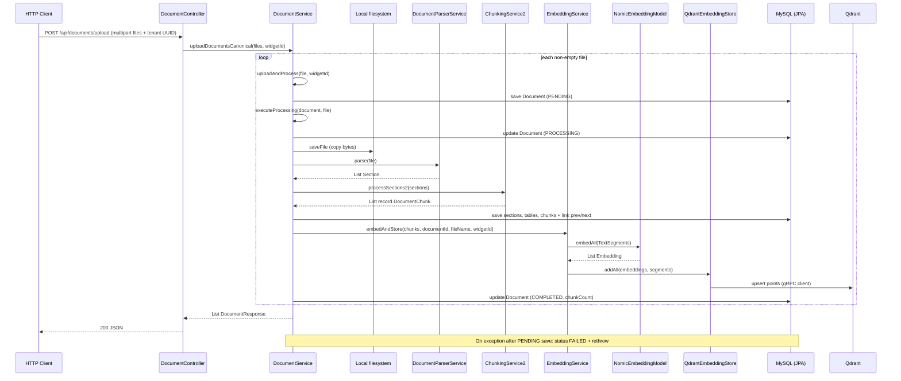

# Cursor Report 12A - CORE_INGESTION_EMBEDDING_FLOW_AUDIT

**Ngày:** 2026-05-13  
**Loại:** Audit read-only — **không sửa source**, mô tả theo code hiện tại trong workspace.

---

## 1. Mức độ hiểu task

| Mục | Nội dung |
|-----|----------|
| **Task là gì?** | Tài liệu hóa luồng core **upload → validate → parse → chunk → lưu DB → embedding → Qdrant → status/error/retry/delete** dựa trên source Java + config; không đi sâu UI/chat generation. |
| **Hiểu task** | **95%** |
| **Phần chắc chắn** | `DocumentController` entrypoints; `DocumentService.uploadAndProcess` / `executeProcessing`; `DocumentParserService.parse`; `ChunkingService2.processSections2`; `EmbeddingService.embedAndStore`; `QdrantConfig` + `NomicEmbeddingModel`; enum `DocumentStatus`; entity `Document` / `DocumentChunk`; retry/delete/assign rules trong `DocumentService` + controller. |
| **Phần chưa xác định từ source hiện tại** | Định dạng **point ID** cụ thể do thư viện LangChain4j gán khi `addAll` (không đọc implementation jar tại đây). Cột JPA `DocumentChunk.qdrantPointId` **không** thấy được gán ở bất kỳ service nào đã grep — có thể luôn null tại runtime (chỉ khẳng định “không có writer trong repo”). |
| **Phạm vi không làm** | Sửa code, migration, FE, đổi prompt/RAG ngoài mô tả ngắn mục 14. |

---

## 2. Files/rules/reports đã đọc

### 2.1 `.cursor/rules` (đủ 6 file)

| File | Mục đích đọc | Kết luận chính |
|------|----------------|----------------|
| `00-core-working-rule.mdc` | Luật nền | Stack: Spring Boot, MySQL, Qdrant, Groq LLM, Nomic embedding; ưu tiên minimal change (không áp dụng cho audit). |
| `10-backend-rag-rule.mdc` | Gợi ý file ingest | Trỏ `DocumentController`, `DocumentService`, `DocumentParserService`, `ChunkingService2`, `EmbeddingService`, domain document. |
| `20-frontend-widget-rule.mdc` | Phạm vi | Audit ingest không mở rộng FE. |
| `30-deploy-env-ops-rule.mdc` | Env/deploy | GROQ/NOMIC, Qdrant host/port/collection/vector-size, upload dir. |
| `40-db-vector-rule.mdc` | Vector/DB | Không đổi schema; nhấn filter collection/size. |
| `90-report-verification-rule.mdc` | Report sau sửa code | Rule mặc định `docs/`; prompt 12A yêu cầu report dưới `reports/` — tuân theo prompt 12A. |

### 2.2 Reports bắt buộc (đều **tồn tại** đã đọc)

| File | Mục đích đọc | Kết luận chính |
|------|----------------|----------------|
| `reports/CURSOR_REPORT_00_BACKEND_FLOW_AND_FE_CONTRACT_AUDIT.md` | Baseline ingest | Legacy `POST /upload/{widgetId}`; pipeline parse→chunk2→embed; map `chatbot`≈`WidgetConfig`; thiếu purge Qdrant khi delete (đã biết từ 00). |
| `reports/CURSOR_REPORT_03A_BACKEND_DOCUMENTS_API_CONTRACT_ALIGNMENT_AND_SAFE_CANONICAL_ENDPOINTS.md` | API documents | Canonical `POST /api/documents/upload` + tenant; retry hẹp; delete soft, không purge vector; assign blocked. |
| `reports/CURSOR_REPORT_03C_BACKEND_DOCUMENTS_RUNTIME_SMOKE_TEST.md` | Smoke | Upload + tenant PASS; delete không purge Qdrant. |
| `reports/CURSOR_REPORT_08D1_FIX_ACTUAL_DOCUMENTS_LIST_500.md` | Widget orphan | `EntityNotFoundException` khi widget soft-delete; fallback "Unknown chatbot". |
| `reports/CURSOR_REPORT_10A_LIVE_API_SMOKE_AND_BROWSER_REGRESSION_RERUN.md` | Regression tổng | Documents list/filter; không focus ingest sâu. |
| `reports/CURSOR_REPORT_11B_MVP_RAG_QUALITY_EMBED_ORIGINS_DASHBOARD_UX.md` | RAG quality | Retrieval/prompt thay đổi gần đây; chunking/parser không đổi trong report đó. |

### 2.3 Source backend / config chính

| File | Mục đích đọc | Kết luận chính |
|------|----------------|----------------|
| `Backend/.../api/DocumentController.java` | HTTP entry | Legacy + canonical upload; list/status/chunks/retry/delete/assign. |
| `Backend/.../service/DocumentService.java` | Pipeline orchestration | `executeProcessing`: PROCESSING → parse → chunk → save section/table/chunk → embed → COMPLETED; lỗi → FAILED. |
| `Backend/.../service/DocumentParserService.java` | PDF/TXT parse | PDFBox + Tabula; section regex; chỉ **PDF và TXT** (throw nếu khác). |
| `Backend/.../service/ChunkingService2.java` | Chunking | `processSections2`; char limit 2200, overlap 250; table/summary types. |
| `Backend/.../service/EmbeddingService.java` | Embed + Qdrant upsert | `embedAll` + `qdrantEmbeddingStore.addAll`; metadata payload; `buildEmbeddingText` kèm heading/type. |
| `Backend/.../service/RagRetrievalService.java` | Liên quan vector | `embeddingService.search(..., ANCHOR_TOP_K=30, widgetId)` filter `widgetId`; mở rộng chunk từ **DB** theo `chunk_id` trong payload. |
| `Backend/.../config/QdrantConfig.java` | Collection bootstrap | `ApplicationRunner`: GET collection → nếu 404 thì PUT tạo vectors `size` + distance **Cosine**. |
| `Backend/.../config/GroqConfig.java` | Beans AI | `NomicEmbeddingModel` từ `nomic.api-key` + `nomic.embedding-model`. |
| `Backend/.../domain/document/Document.java` | Entity | FK `widget_config_id`; status; soft delete `deleted_at` + `@SQLRestriction`. |
| `Backend/.../domain/document/DocumentChunk.java` | Entity | `chunkIndex`, `qdrantPointId` (không thấy writer trong service). |
| `Backend/.../domain/enums/DocumentStatus.java` | Enum | `PENDING`, `PROCESSING`, `COMPLETED`, `FAILED`. |
| `Backend/.../domain/widget/WidgetConfig.java` | Tenant | UUID `id`; `@SQLRestriction` soft-delete widget. |
| `Backend/.../record/Section.java`, `record/DocumentChunk.java` | Pipeline DTO | Section sau parse; chunk record trước khi map JPA entity. |
| `Backend/src/main/resources/application.yml` | Multipart | `max-file-size` / `max-request-size` **50MB**; `app.upload-dir`. |
| `Backend/src/main/resources/application-dev.yml` | Runtime dev | MySQL, `qdrant.*`, `nomic.*`, `groq.*`, collection `documents`, vector **768**. |
| `Backend/src/main/resources/application-docker.yml` | Docker profile | Tương tự: Qdrant host `qdrant`, vector 768, Nomic. |
| `Backend/pom.xml` (grep) | Dependencies | `pdfbox`, `tabula`, `langchain4j-nomic`, `langchain4j-qdrant`. |
| `docker-compose.yml` | Infra | `mysql`, `qdrant`, backend env `GROQ_API_KEY`, `NOMIC_API_KEY`. |
| `Backend/.env.example` | Env doc | `GROQ_API_KEY`, `NOMIC_API_KEY` required. |
| `Backend/src/test/.../QdrantConnectionTest.java` | Test | Smoke `QdrantEmbeddingStore` bean. |

### 2.4 File prompt liệt kê nhưng **không tồn tại** trong repo

| Path (theo prompt) | Ghi chú |
|--------------------|---------|
| `Backend/.../service/ChunkingService.java` | **Không có** — chỉ có `ChunkingService2.java`. |
| `Backend/.../service/QdrantService.java` | **Không có** — Qdrant qua `QdrantEmbeddingStore` + REST search trong `EmbeddingService`. |
| `Backend/src/test/**/*Document*.java` | **0 file** khớp glob. |
| `Backend/src/test/**/*Embedding*.java` | **0 file**. |
| Root `.env.example` | **Không thấy** trong glob (có `Backend/.env.example`, `Frontend/.env.example`). |

---

## 3. Executive summary

1. Client gọi **`POST /api/documents/upload`** (multipart) với **`files[]`** và bắt buộc **`chatbotId` hoặc `widgetId`** (UUID string trong `@RequestParam` — Spring bind được từ query hoặc form part cùng tên), hoặc gọi legacy **`POST /api/documents/upload/{widgetId}`** với param **`file`** (đơn).
2. Controller canonical resolve tenant UUID → `widgetConfigRepository.existsById` → `documentService.uploadDocumentsCanonical`.
3. `DocumentService.uploadAndProcess`: resolve `WidgetConfig`, **`saveFile`** xuống `${app.upload-dir}`, tạo **`Document`** `PENDING`, save DB, gọi **`executeProcessing`**.
4. `executeProcessing`: set **`PROCESSING`** → **`documentParserService.parse(file)`** → **`chunkingService2.processSections2(sections)`** → **`saveSections` / `saveTables` / `saveChunks`** + **`linkPrevNextChunks`** → **`embeddingService.embedAndStore`** → **`COMPLETED`** + `chunkCount`.
5. Parser PDF: **PDFBox** text theo trang + **Tabula** (SpreadsheetExtractionAlgorithm, fallback BasicExtractionAlgorithm) + optional **pseudo-table** trong raw text; output **`List<Section>`**. TXT: toàn bộ như **trang 1**.
6. Chunking: **`ChunkingService2`** — giới hạn ký tự, overlap, tách bảng markdown, loại chunk `text`, `table_*`, `section_summary`, `parent_section_summary`, `text_table_like`, …
7. Embedding: **`NomicEmbeddingModel.embedAll`** trên danh sách **`TextSegment`** có **Metadata** đầy đủ → **`QdrantEmbeddingStore.addAll`**.
8. Qdrant: collection từ **`qdrant.collection-name`** (mặc định **`documents`**), vector size **`qdrant.vector-size`** (**768**), distance **Cosine** khi tạo collection mới (`QdrantConfig`).
9. Status FE map: `COMPLETED`→`INDEXED`, `PENDING`/`PROCESSING`→`PROCESSING`, `FAILED`→`FAILED`; **progress** heuristic 0/50/100 (không có % thời gian thực từ pipeline).
10. Lỗi giữa chừng: `Document` → **`FAILED`** + log; exception bubble (canonical/legacy xử lý HTTP khác nhau).
11. **Retry** chỉ khi `FAILED` và **không** có chunk/section/table + file còn trên disk. **Delete** soft `documents.deleted_at`; **không** xóa vectors Qdrant trong code. **Assign** luôn từ chối (cần re-index).

---

## 4. API entrypoint

### 4.1 Canonical (FE contract)

| Thuộc tính | Giá trị từ source |
|------------|-------------------|
| **Method / path** | `POST /api/documents/upload` |
| **Content-Type** | `multipart/form-data` (`consumes = MULTIPART_FORM_DATA_VALUE`) |
| **Multipart / params** | **`files`**: `MultipartFile[]` (optional false → có thể null). **`chatbotId`**, **`widgetId`**: optional string; controller lấy **một** trong hai nếu non-blank (ưu tiên `chatbotId` rồi `widgetId`). Không đọc `@RequestParam` từ một DTO riêng — chỉ param tên cố định (Spring vẫn bind query string cùng tên). |
| **Tenant validation** | Parse UUID; `widgetConfigRepository.existsById(tenantId)` — nếu false → **400** `{"message":"Chatbot/widget không tồn tại."}` |
| **Thiếu tenant** | **400** `{"message":"chatbotId is required for document upload"}` |
| **UUID sai định dạng** | **400** `Invalid chatbotId or widgetId` |
| **Response 200** | `List<DocumentResponse>` — `documentService.uploadDocumentsCanonical` |
| **Lỗi business** | **400** `{ "message": ... }` (`IllegalArgumentException`); **500** `{ "message": ... }` (`IOException` từ service). |
| **Batch behavior** | Vòng lặp từng file: **một file exception → fail cả batch** (throw sau vòng lặp). Bỏ qua `file == null || file.isEmpty()`; nếu không còn file hợp lệ → **400** "Không có file hợp lệ để upload." |
| **Giới hạn kích thước** | `spring.servlet.multipart.max-file-size` / `max-request-size`: **50MB** (`application.yml`). |
| **Kiểu file** | **Không** validate MIME/extension ở controller; `DocumentParserService.parse` chỉ chấp nhận **`.pdf` / `.txt`** (so khớp **tên file**). `getFileType` trong `DocumentService` nhận diện thêm `.docx`/`.doc` nhưng parse vẫn throw với không phải pdf/txt. |

### 4.2 Legacy

| Thuộc tính | Giá trị |
|------------|---------|
| **Method / path** | `POST /api/documents/upload/{widgetId}` |
| **Param** | **`file`** — một `MultipartFile` |
| **Response** | `DocumentUploadResponse` (id, fileName, status, message) |
| **Lỗi** | `IllegalArgumentException` → **400** body FAILED message; khác → **500** FAILED |

### 4.3 `chatbotId` map sang entity nào

Trong backend hiện tại **không có** entity `Chatbot` tách; **`chatbotId` FE = UUID của `WidgetConfig.id`** (cùng bảng `widget_configs`, `existsById` trên repo đó). Điều này khớp các report 00/03A/03C.

---

## 5. Sequence flow chi tiết

| Step | Class/Method | Input | Action | Output / side effect | Error handling |
|------|--------------|-------|--------|----------------------|----------------|
| 1 | `DocumentController.uploadCanonical` | `files[]`, `chatbotId`/`widgetId` | Validate tenant UUID + widget tồn tại | Gọi service hoặc 400 JSON | Invalid UUID / missing tenant / widget missing |
| 2 | `DocumentService.uploadDocumentsCanonical` | `MultipartFile[]`, `UUID widgetId` | Lặp từng file non-empty → `uploadAndProcess` | `List<DocumentResponse>` | Empty array → 400; per-file exception aborts batch |
| 3 | `DocumentService.uploadAndProcess` | `file`, `widgetId` | `findById` widget | `WidgetConfig` | `IllegalArgumentException` nếu không có widget |
| 4 | `DocumentService.saveFile` | `MultipartFile` | Ghi disk under `app.upload-dir`, tên `timestamp_sanitizedName` | `String` absolute path | `IOException` |
| 5 | `DocumentService.uploadAndProcess` | paths + metadata | Build `Document` `PENDING`, `save` | Row `documents` | — |
| 6 | `DocumentService.executeProcessing` | `Document`, `file` | `status=PROCESSING`, `save` | DB update | — |
| 7 | `DocumentParserService.parse` | `MultipartFile` | PDF hoặc TXT → `List<Section>` | sections | `IllegalArgumentException` tên/định dạng; `IOException` PDF |
| 8 | `ChunkingService2.processSections2` | `List<Section>` | Sinh record `DocumentChunk` | List chunk DTO | (logic nội bộ, có thể rỗng) |
| 9 | `DocumentService.saveSections` | sections, doc, widget | Insert `document_sections` | `Map<sectionKey, DocumentSection>` | — |
| 10 | `DocumentService.saveTables` | chunks, sectionMap, … | Insert `document_tables` | `Map<tableId, DocumentTable>` | — |
| 11 | `DocumentService.saveChunks` | chunks, maps, doc, widget | `saveAll` JPA chunks `chunkIndex` **0..n-1** | `List<DocumentChunk>` (có UUID id) | — |
| 12 | `DocumentService.linkPrevNextChunks` | saved chunks | Set prev/next FK, `saveAll` | DB update links | — |
| 13 | `EmbeddingService.embedAndStore` | saved chunks, documentId, fileName, widgetId | Build `TextSegment`+Metadata per chunk; `embeddingModel.embedAll`; `qdrantEmbeddingStore.addAll` | Vectors trong Qdrant | Exception → bubble lên step 14 |
| 14 | `DocumentService.executeProcessing` (cuối) | document | `COMPLETED`, `chunkCount` | DB | Nếu exception ở trên: không tới đây |
| 15 | `DocumentService.uploadAndProcess` catch | `Exception` | `FAILED` + `save` + log | DB | Rethrow `IOException` / `RuntimeException` / wrap `IllegalStateException` |

**Ghi chú:** Nếu `chunks.isEmpty()`, `embedAndStore` **return sớm** (không gọi API embed); document vẫn được set **`COMPLETED`** với **`chunkCount = 0`** (hành vi từ `executeProcessing` không nhánh đặc biệt cho empty).

---

## 6. Mermaid sequence diagram

---

## 7. Data model mapping

### 7.1 `Document`

| Field | Meaning | Set tại bước | Notes |
|-------|---------|--------------|-------|
| `id` | UUID PK | JPA `@GeneratedValue` khi save lần đầu | |
| `widgetConfig` | FK chatbot/tenant | `uploadAndProcess` builder | Lazy ManyToOne |
| `fileName` | Tên gốc upload | từ `MultipartFile.getOriginalFilename()` | |
| `filePath` | Đường dẫn file đã lưu | sau `saveFile` | Dùng retry đọc lại từ disk |
| `fileType` | PDF/TXT/DOCX/… | `getFileType(fileName)` | Extension-based; DOCX không parse được |
| `mimeType` | MIME client | `getContentType()` | nullable |
| `fileSize` | bytes | `getSize()` | |
| `checksum` | optional unique | **Không set** trong `uploadAndProcess` | Có thể null |
| `status` | lifecycle | `PENDING` → `PROCESSING` → `COMPLETED` hoặc `FAILED` | Enum `DocumentStatus` |
| `chunkCount` | số chunk | Cuối `executeProcessing` | |
| `createdAt` / `updatedAt` | timestamps | Hibernate annotations | |
| `deletedAt` | soft delete | `softDeleteDocument` | `@SQLRestriction` ẩn row khi null |

**Không có** cột `error` text trên entity — message lỗi cho FE là **chuỗi cố định** trong DTO mapper khi `FAILED`.

### 7.2 `DocumentChunk`

| Field | Meaning | Ghi chú |
|-------|---------|---------|
| `id` | UUID | Sinh trước khi embed → đưa vào metadata `chunk_id` |
| `document` | FK | |
| `widgetConfig` | FK | Denormalized |
| `section` / `table` | FK | Từ `sectionMap` / `tableMap` |
| `chunkIndex` | thứ tự 0-based | Vòng lặng `i` trong `saveChunks` (theo thứ tự list chunk sau chunking) |
| `content` | nội dung index | |
| `qdrantPointId` | UUID point | **Không thấy** service gán trong repo |
| `sectionId`, `parentId`, `tableId` | id logic | Chuỗi `sec_*`, `parent_*`, `tbl_*` |
| `chunkType` | loại chunk | text, table_*, section_summary, … |
| `sectionTitle`, `headingPathText` | metadata hiển thị/RAG | `sectionTitle` map từ `chunk.header()` record |
| `pageStart` / `pageEnd` | trang | Từ `Section` / chunk record |
| `orderIndex` | thứ tự chunk toàn doc | Từ `ChunkingService2` `globalOrder` |
| `sectionOrder`, `headingLevel`, `childSectionIds` | hierarchy | |
| `prevChunk` / `nextChunk` | liên kết | Sau `linkPrevNextChunks` |
| `tokenCount` | ước lượng | `max(1, content.length/4)` trong chunking |
| `sourceFile` | tên file nguồn | `document.getFileName()` |
| `deletedAt` | soft delete chunk | **Không** thấy pipeline ingest set |

### 7.3 `WidgetConfig` / quan hệ

- `Document.widget_config_id` trỏ tới **`WidgetConfig.id`**.
- **`chatbotId`** trên API documents = **UUID widget** (không có bảng chatbot riêng trong luồng này).
- Widget **soft-delete** (`deleted_at`): Hibernate `@SQLRestriction` có thể khiến access `widgetConfig` ném **`EntityNotFoundException`** — `DocumentService.toDocumentResponse` bắt và hiển thị **"Unknown chatbot"** (theo 08D1 + code hiện tại).

---

## 8. Parser flow

### 8.1 Định dạng hỗ trợ

| Extension | Hỗ trợ parse? | Thư viện / cách |
|-----------|---------------|-----------------|
| **`.pdf`** | Có | **PDFBox** `Loader.loadPDF` + `PDFTextStripper` (theo trang, `sortByPosition`); **Tabula** `ObjectExtractor` + `SpreadsheetExtractionAlgorithm`, fallback `BasicExtractionAlgorithm`; merge bảng continuation trang trước khi có thể. |
| **`.txt`** | Có | Đọc bytes **UTF-8**; coi toàn file là **trang 1**; `parseSections` giống PDF. |
| **Khác** (gồm `.docx` trong tên) | **Không** | `parse()` throw `IllegalArgumentException` "Chỉ hỗ trợ file PDF và TXT" |

### 8.2 Text / table / page / section

- **Text:** stripper theo `pageNum`; `cleanText` chuẩn hóa whitespace, giữ block `[TABLE_START]…[TABLE_END]`, lọc dòng footer page number pattern.
- **Table:** Tabula → markdown qua `convertTableToMarkdown`; nếu không có usable spreadsheet → **EarlyDetect** `detectTablesInRawText` (cột space-aligned).
- **Page:** PDF 1-based per page map; TXT map key `1`.
- **Section:** `parseSections` — regex heading dạng số `2.1 Title` đầu dòng; mask vùng table khi scan heading; heuristic `headingSkipReason` / `isStructurallyConsistentHeading`.
- **Output trung gian:** `List<Section>` (`record.Section`: header, startPage, endPage, content, orderIndex, headingLevel).

### 8.3 Limitation (có căn cứ source)

- **Không OCR** — PDF scan không có text layer sẽ không có nội dung hữu ích (PDFBox text rỗng; không pipeline Tesseract).
- **DOCX:** `getFileType` trả `DOCX` nhưng **`parse` không hỗ trợ** → fail ingest.
- **Section heading:** phụ thuộc regex + heuristic; có thể miss hoặc nhận nhầm (code đã log SKIP/ACCEPT).
- **Bảng:** Tabula fail trang → có thể chỉ còn text hoặc pseudo-table; reject table qua `isUsableTable` (tối thiểu rows/cols/non-empty).

---

## 9. Chunking flow

| Hạng mục | Giá trị / hành vi |
|----------|-------------------|
| **Service** | `ChunkingService2.processSections2` |
| **Input** | `List<Section>` |
| **Kích thước chunk text** | `MAX_CHARS_PER_TEXT_CHUNK = 2200` |
| **Overlap** | `OVERLAP_CHARS = 250` (khi split dài) |
| **Token count** | `Math.max(1, content.length() / 4)` (ước lượng, không gọi tokenizer) |
| **Ran giới text** | Ưu tiên theo **đoạn** (`chunkByParagraphs`); nếu không tách được nhiều paragraph thì split theo cửa sổ ký tự + newline/câu. |
| **Bảng** | `splitByTableBlocks`: marker `[TABLE_START]` hoặc dòng `\|...\|`; `TABLE_ROWS_PER_GROUP = 10`; thêm `table_summary` + các `table_row_group`. |
| **Section dài** | Nếu tổng ký tự text segments > `SECTION_SUMMARY_THRESHOLD` (`4400`) → thêm chunk `section_summary`. |
| **Parent có con** | Chunk `parent_section_summary` + `child_section_ids`. |
| **chunkIndex trong DB** | Thứ tự **`saveChunks`** theo index vòng lặp `0..size-1` (không sort lại theo `orderIndex`). |
| **Limitation** | Nhiều bảng / nhiều đoạn trong một section có thể nằm chung chunk text trước khi split; `text_table_like` khi không build được markdown nhưng nội dung “giống bảng”. |

---

## 10. Embedding flow

| Hạng mục | Chi tiết source |
|----------|-----------------|
| **Điểm gọi** | `EmbeddingService.embedAndStore` từ `DocumentService.executeProcessing` (sau khi chunk đã có UUID trong DB). |
| **Provider** | **Nomic** — `NomicEmbeddingModel` bean `GroqConfig.embeddingModel()`. |
| **Env / property** | `nomic.api-key` ← **`NOMIC_API_KEY`**; `nomic.embedding-model` (vd `nomic-embed-text-v1.5` trong `application-dev.yml`). Model dùng default base URL của LangChain4j Nomic (không override baseUrl trong `GroqConfig`). |
| **Input embed** | `buildEmbeddingText(chunk)`: ưu tiên **`headingPathText`** + newline; else **`sectionTitle`**; thêm dòng **`Type: {chunkType}`**; nối **`content`**. |
| **Batch** | Một lệnh **`embeddingModel.embedAll(segments)`** cho toàn bộ chunk của document. |
| **Dimension** | Phải khớp **`qdrant.vector-size`** (**768** trong yaml dev/docker); Nomic model config phải tương thích (không verify model card trong repo). |
| **Lỗi** | Không try/catch trong `embedAndStore` — lỗi → `executeProcessing` fail → `uploadAndProcess` catch → **`FAILED`**. |
| **Retry** | Không retry riêng cho Nomic/Qdrant trong `EmbeddingService`. |
| **Rate limit** | Không có backoff/retry trong service. |

---

## 11. Qdrant vector storage flow

| Hạng mục | Chi tiết |
|----------|----------|
| **Upsert** | `qdrantEmbeddingStore.addAll(embeddings, segments)` sau `embedAll`. |
| **Collection** | `${qdrant.collection-name}` → **`documents`**. |
| **Vector size / distance** | Tạo collection khi chưa tồn tại: **`size`** = `qdrant.vector-size` (**768**), **`distance`** = **`Cosine`** (`QdrantConfig.initQdrantCollection`). |
| **Point ID** | Do implementation **LangChain4j QdrantEmbeddingStore** quyết định — không set thủ công trong project. |
| **Payload / metadata** (Metadata keys đặt trong code) | `chunk_id`, `document_id`, `documentId`, `fileName`, `source_file`, `widgetId`, `chunkIndex`, `chunk_type`, `section_id`, `parent_id`, `section_title`, `heading_path_text`, `page_start`, `page_end`, `order_index`, `section_order`, `heading_level`, optional `child_section_ids`, `table_id`, `prev_chunk_id`, `next_chunk_id`. Text đưa vào store: từ **`buildEmbeddingText`** (LangChain4j thường lưu dưới key payload **`text_segment`** — được `EmbeddingService.search` đọc lại). |
| **Tạo collection** | `ApplicationRunner` lúc startup: GET `/collections/{name}` → 404 thì PUT tạo. |
| **Upload nhiều file** | Mỗi document một lần `addAll` — vectors chứa `document_id` / `chunk_id` riêng. |
| **Delete document** | `softDeleteDocument` chỉ `deleted_at` trên **`Document`** — **không** gọi API xóa point Qdrant (xác nhận trong 03A/03C + không có code purge trong `DocumentService`). |
| **Retry** | Không xóa vector cũ vì retry chỉ khi **chưa có** chunk/section/table (không từng embed thành công trong DB). |
| **Assign chatbot khác** | `assignDocument` luôn throw — không đổi `widgetId` trong payload Qdrant. |

---

## 12. Status / progress / error lifecycle

### 12.1 Enum thật

`PENDING`, `PROCESSING`, `COMPLETED`, `FAILED` — **không** có `INDEXED` trong DB; FE dùng nhãn `INDEXED` map từ `COMPLETED`.

### 12.2 Bảng lifecycle

| Stage | DB `DocumentStatus` | `progressFor` (DTO) | Trigger | Error / ghi chú |
|-------|---------------------|---------------------|---------|-----------------|
| Upload vừa save | `PENDING` | 0 | Sau `documentRepository.save` lần đầu | |
| Bắt đầu xử lý | `PROCESSING` | 50 | Đầu `executeProcessing` | |
| Thành công | `COMPLETED` | 100 | Sau embed + save | `chunkCount` set |
| Thất bại | `FAILED` | 0 | Catch `uploadAndProcess` hoặc `retryFailedDocument` catch | Log có `fileName` + message exception |
| Đã xóa (list) | Row ẩn | — | `deletedAt` set | `@SQLRestriction` — không enum DELETED |

### 12.3 `error` field trên API

- `Document` entity **không** có cột error.
- `DocumentResponse` / `DocumentStatusResponse`: nếu `FAILED` → message cố định **`"Xử lý tài liệu thất bại."`** (không trả stack trace ra client).

### 12.4 Progress

- **`progressFor`**: `COMPLETED`→100, `PROCESSING`→50, `PENDING`/`FAILED`→0 — **không** tính theo % parse/chunk thực.

---

## 13. Retry / delete behavior

### 13.1 Retry

| Mục | Chi tiết |
|-----|----------|
| **Endpoint** | `POST /api/documents/{id}/retry` |
| **Điều kiện** | `Document.status == FAILED`; `documentChunkRepository.findByDocumentId` **rỗng**; `documentSectionRepository…` **rỗng**; `documentTableRepository…` **rỗng**; file tại `document.filePath` **tồn tại**. |
| **Làm lại từ đâu** | Reset `PENDING`, `chunkCount=null`, đọc file qua `BytesMultipartFile.fromPath`, gọi lại **`executeProcessing`**. |
| **Xóa chunk/vector cũ** | Không có chunk nên không cần xóa DB chunk; Qdrant không có point từ lần fail trước nếu fail trước `embedAndStore` (điều kiện “sạch”). Nếu fail **sau** khi đã có chunk thì **không đủ điều kiện retry** theo code hiện tại. |
| **Limitation** | Fail giữa chừng đã persist section/chunk → user phải **xóa document + upload lại** (message tiếng Việt trong code). Không cleanup vector partial nếu từng embed một phần (điều kiện retry đã chặn khi có chunk). |

### 13.2 Delete

| Mục | Chi tiết |
|-----|----------|
| **Endpoint** | `DELETE /api/documents/{id}` |
| **Kiểu** | **Soft delete** `Document.deletedAt = now` |
| **Chunks / sections / tables** | **Không** cascade soft-delete trong method này (chỉ document row ẩn theo restriction). |
| **Qdrant** | **Không** xóa points theo `document_id` trong codebase đã đọc. |
| **Limitation** | Vectors và row chunk cũ có thể còn; retrieval theo `widgetId` vẫn có thể gặp chunk của document đã soft-delete nếu query DB không loại document deleted (ngoài scope audit chi tiết từng query repository tại đây). |

### 13.3 Assign

| Mục | Chi tiết |
|-----|----------|
| **Endpoint** | `POST /api/documents/{id}/assign` |
| **Hành vi** | `assignDocument` nếu `targetChatbotId == null` → throw bắt buộc chatbotId; ngược lại throw **re-index Qdrant chưa hỗ trợ**. Controller sau `try/catch` có dòng return `Assignment not supported` — **về lý thuyết dead code** vì `assignDocument` luôn throw trước khi return thành công. Thực tế client luôn nhận **400** với message từ exception. |

---

## 14. Retrieval connection summary

- **Lọc theo chatbot/tenant:** `EmbeddingService.search` đặt Qdrant filter **`must` match `widgetId`** (string UUID).
- **Query embedding:** cùng bean **`EmbeddingModel`** (Nomic) — `embedAll` một segment text query.
- **topK:** **`ANCHOR_TOP_K = 30`** mỗi query variant trong `RagRetrievalService`.
- **Nguồn nội dung đưa vào LLM:** sau khi mở rộng từ DB, `dedupeSortBudget` build `RetrievedContext` từ **`DocumentChunk.getContent()`** (MySQL), không dùng trực tiếp chuỗi từ Qdrant payload làm body chính.
- **Vì sao metadata chunk quan trọng:** vector payload/`DocumentChunk` mang `section_id`, `chunk_type`, `heading_path_text`, `child_section_ids` để **heading lock**, **parent expand**, window `orderIndex`, và citation (`sectionTitle`, `pageStart`/`pageEnd`).

---

## 15. Environment dependencies

| Dependency | Cần cho | Config / env | Khi fail |
|------------|---------|--------------|----------|
| **MySQL** | Ingest + list + retrieval DB | `spring.datasource.*` (`application-dev.yml` / `application-docker.yml`) | JPA throw, upload/list fail |
| **Qdrant** (gRPC + HTTP) | Lưu vector + search | `qdrant.host`, `qdrant.port` (gRPC store), `qdrant.http-port` (REST search) | `addAll` / search throw → document **FAILED** hoặc retrieval skip variant |
| **NOMIC_API_KEY** | Embedding ingest + query embed | `nomic.api-key` | Context/embed fail |
| **GROQ_API_KEY** | **Chỉ chat** (không dùng trong ingest pipeline) | `groq.api-key` | Ingest vẫn chạy nếu chỉ cần embed |
| **PDFBox / Tabula** | Parse PDF | Maven deps | Parse exception → **FAILED** |
| **Docker** | Runtime deploy | `docker-compose.yml` mysql + qdrant + backend env | Ops |

---

## 16. Known limitations / risk list

(Chỉ nêu có căn cứ từ source/reports đã đọc.)

1. **DOCX/DOC:** `getFileType` nhận diện nhưng **`DocumentParserService` không parse** → upload fail với message định dạng.
2. **Không OCR / scanned PDF** không có text layer.
3. **Qdrant vectors không purge** khi `DELETE` document (03A/03C + `softDeleteDocument`).
4. **`DocumentChunk.qdrantPointId`** không được populate trong service — khó reconcile/delete point theo DB id từ app code.
5. **Retry hẹp** — chỉ khi fail “sạng” không có chunk/section/table và file còn disk.
6. **Assign** không hỗ trợ — payload `widgetId` trên vector không được cập nhật.
7. **Batch upload:** một file lỗi → **cả batch** fail.
8. **Progress** không phản ánh bước thực (chỉ 0/50/100).
9. **Widget soft-delete** → document list có thể **"Unknown chatbot"** (08D1).
10. **Chunk lớn / nhiều bảng** trong một section ảnh hưởng chất lượng RAG (đã thảo luận ở 11B — không đổi kết luận ingest tại đây).

---

## 17. Suggested follow-up prompts

| Prompt name | Purpose | Priority | Risk |
|-------------|---------|----------|------|
| **12B_CORE_INGESTION_RUNTIME_TRACE_WITH_SAMPLE_DOCUMENT** | Trace một PDF+TXT thật: log số section/chunk, 1 point payload sample (không secret). | Medium | Cần env + time |
| **12C_QDRANT_PURGE_ON_DOCUMENT_DELETE** | Thiết kế xóa points theo `document_id` / `widgetId` khi soft/hard delete. | High | Sai filter → mất data |
| **12D_DOCX_PARSER_SUPPORT** | Parser Apache POI hoặc tương đương nếu product cần DOCX. | Medium | Dependency + bảo mật file |
| **12E_EMBEDDING_PARTIAL_FAILURE_RECOVERY** | Retry batch nhỏ / resume khi `embedAll` fail giữa chừng. | Medium | Trùng vector nếu thiết kế sai |

---

## 18. Final conclusion

- **Luồng core hiện tại:** Lưu file → **PDF/TXT parse** (PDFBox+Tabula) thành sections → **ChunkingService2** → persist **sections/tables/chunks** MySQL → **Nomic embedAll** → **Qdrant addAll** trong collection **`documents`** (768-d Cosine) → **`COMPLETED`**.
- **Đủ MVP không:** Có — với tài liệu **PDF/TXT** và env **MySQL + Qdrant + NOMIC**; API tenant đã canonical.
- **Cẩn trọng khi demo:** DOCX; PDF scan; delete document nhưng vector còn; batch một file hỏng làm fail cả lô; progress không realtime.
- **Sau MVP:** Purge Qdrant theo document; gán `qdrantPointId` hoặc delete-by-filter; DOCX; retry/partial embed an toàn hơn.

---

## 19. Validation (audit)

| Command | Kết quả | Ghi chú |
|---------|---------|---------|
| `cd Backend; .\mvnw.cmd -DskipTests compile` | **PASS** | exit code 0 (2026-05-13) |
| `mvnw test` | **NOT RUN** | Ngoài yêu cầu tối thiểu audit |
| `docker compose config` | **NOT RUN** | Không bắt buộc cho audit ingest |

---

*Tài liệu này chỉ mô tả behavior từ source đã đọc; mọi giả định về implementation nội bộ LangChain4j không có trong repo được ghi là “Chưa xác định từ source hiện tại” ở mục 1.*
